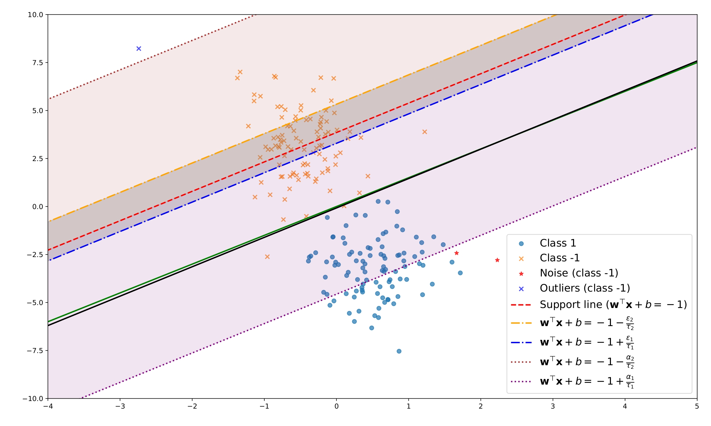

<div align="center">

## Robust Support Vector Machine With Asymmetric Truncated Generalized Pinball Loss

[**Siwakon Suppalap**](https://www.researchgate.net/profile/Siwakon-Suppalap)&nbsp;&nbsp;&nbsp;&nbsp;
[**Rabian Wangkeeree**](https://www.researchgate.net/profile/Rabian-Wangkeeree)&nbsp;&nbsp;&nbsp;&nbsp;


<a href="https://ieeexplore.ieee.org/abstract/document/10731881">
    
</a> &ensp;


</div>



> **Abstract:** The support vector machine (SVM) with pinball loss (Pin-SVM) can handle noise sensitivity and instability to re-sampling but loses sparsity.  To solve this limitation, SVM with a generalized pinball loss that incorporates an insensitive zone (GP-SVM) was proposed.  The GP-SVM  can handle sparsity by optimizing the asymmetric spread of the insensitive zone. Despite these improvements,  the boundlessness of the loss functions can result in a lack of robustness to outliers. In this work, we introduce a novel robust support vector classification based on an $(\alpha_{1}, \alpha_{2})$-asymmetric bounded loss function, an asymmetric truncated generalized pinball loss (called $L_{tgp}^{\alpha_{1}, \alpha_{2}}$). A characteristic of SVM with $L_{tgp}^{\alpha_{1}, \alpha_{2}}$ (ATGP-SVM) is its ability to balance generalization and sparsity while minimizing the impact of outliers. However, $L_{tgp}^{\alpha_{1}, \alpha_{2}}$ is a non-convex function, ATGP-SVM is difficult to solve. Therefore, we formulated the ATGP-SVM utilizing a difference of convex function programming (DC) and subsequently resolved it through the DC algorithm (DCA). The experimental results obtained from diverse benchmark datasets underscore the effectiveness of our proposed formulation when compared to other state-of-the-art classification models.


## 📖 Citation

If you find it useful for your research or applications, please cite our paper:

```bibtex
@ARTICLE{10731881,
  author={Suppalap, Siwakon and Wangkeeree, Rabian},
  journal={IEEE Access}, 
  title={Robust Support Vector Machine With Asymmetric Truncated Generalized Pinball Loss}, 
  year={2024},
  volume={12},
  number={},
  pages={155696-155717},
  keywords={Support vector machines;Noise;Fasteners;Vectors;Sensitivity;Optimization methods;Convex functions;Training;Robustness;Programming;Support vector machine;pinball loss;generalized pinball loss;sparsity;difference of convex functions programming},
  doi={10.1109/ACCESS.2024.3485214}}
```

